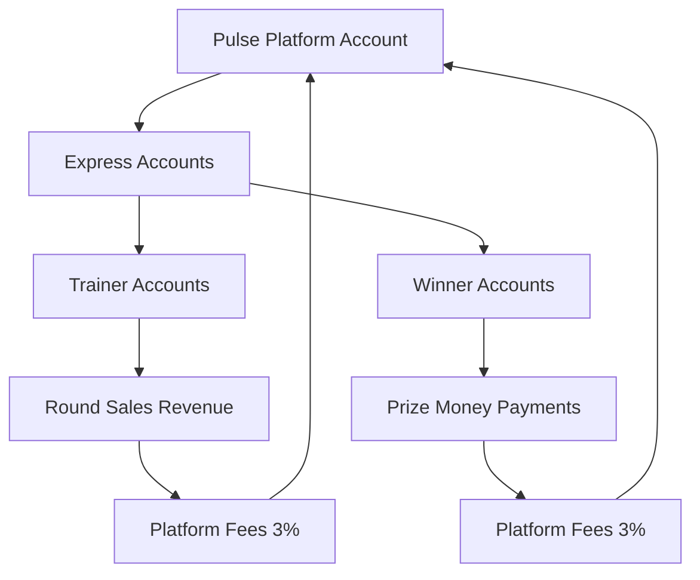
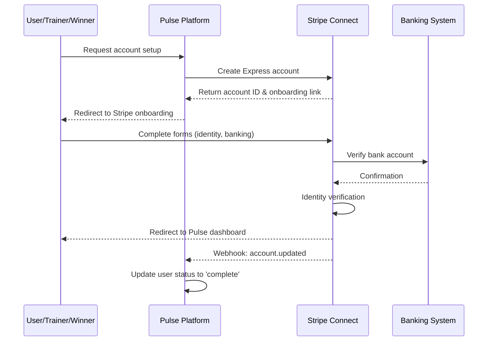
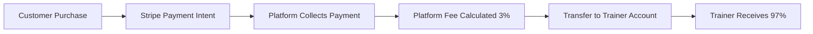

# Pulse Stripe Connect System - Complete Infrastructure Guide

## Table of Contents
1. [Stripe Connect Overview](#stripe-connect-overview)
2. [Account Types & Structure](#account-types--structure)
3. [Onboarding Infrastructure](#onboarding-infrastructure)
4. [Payment Processing Architecture](#payment-processing-architecture)
5. [Platform Fee Structure](#platform-fee-structure)
6. [Dashboard & Management](#dashboard--management)
7. [Compliance & Verification](#compliance--verification)
8. [Data Models & Storage](#data-models--storage)
9. [API Infrastructure](#api-infrastructure)
10. [Error Handling & Recovery](#error-handling--recovery)
11. [Testing & Development](#testing--development)
12. [Security & Best Practices](#security--best-practices)

---

## Stripe Connect Overview

### What is Stripe Connect?
Stripe Connect is a platform solution that allows Pulse to facilitate payments between multiple parties while maintaining compliance and reducing liability. It enables us to:

- **Create sub-accounts** for trainers and winners
- **Process payments** on behalf of connected accounts
- **Collect platform fees** automatically
- **Manage compliance** and verification
- **Provide dashboards** for earnings tracking

### Pulse's Connect Implementation


### Key Benefits
- **Reduced PCI compliance** burden
- **Automated tax reporting** (1099s)
- **Built-in fraud protection**
- **Identity verification** handling
- **Banking integration** management
- **Dispute resolution** support

---

## Account Types & Structure

### 1. Platform Account (Pulse)
**Type**: Standard Stripe Account  
**Purpose**: Main platform account that manages all Connect operations

**Capabilities**:
- Create and manage Express accounts
- Process payments on behalf of connected accounts
- Collect application fees
- Access comprehensive reporting
- Manage disputes and chargebacks

**Configuration**:
```javascript
// Platform account settings
{
  business_type: "company",
  company: {
    name: "Pulse Technologies Inc",
    tax_id: "XX-XXXXXXX"
  },
  capabilities: [
    "card_payments",
    "transfers", 
    "legacy_payments"
  ]
}
```

### 2. Express Accounts (Trainers & Winners)
**Type**: Stripe Express Accounts  
**Purpose**: Sub-accounts for individuals receiving payments

**Why Express Accounts?**
- **Simplified onboarding** (Stripe-hosted forms)
- **Reduced platform liability** 
- **Automatic compliance** handling
- **Built-in identity verification**
- **Streamlined tax reporting**

**Account Structure**:
```javascript
// Express account configuration
{
  type: 'express',
  country: 'US',
  capabilities: {
    card_payments: { requested: true },
    transfers: { requested: true }
  },
  business_type: 'individual',
  business_profile: {
    product_description: 'Fitness training services', // or 'Prize money recipient'
    url: 'https://fitwithpulse.ai/profile/username'
  }
}
```

### Account Lifecycle States
1. **Created** - Account exists but incomplete
2. **Pending** - Information submitted, under review
3. **Restricted** - Limited functionality, additional info needed
4. **Active** - Fully verified, can receive transfers
5. **Rejected** - Failed verification, cannot be used

---

## Onboarding Infrastructure

### Onboarding Flow Architecture


### 1. Account Creation Process

#### For Trainers:
```javascript
// netlify/functions/create-connected-account.js
const account = await stripe.accounts.create({
  type: 'express',
  country: 'US',
  capabilities: {
    card_payments: { requested: true },
    transfers: { requested: true }
  },
  business_type: 'individual',
  business_profile: {
    product_description: 'Fitness training and workout programs',
    url: `https://fitwithpulse.ai/profile/${userData.username}`
  }
});
```

#### For Winners:
```javascript
// netlify/functions/create-winner-connected-account.js  
const account = await stripe.accounts.create({
  type: 'express',
  country: 'US',
  capabilities: {
    card_payments: { requested: true },
    transfers: { requested: true }
  },
  business_type: 'individual',
  business_profile: {
    product_description: 'Challenge winner prize money recipient',
    url: `https://fitwithpulse.ai/profile/${userData.username}`
  }
});
```

### 2. Onboarding Link Generation
```javascript
const accountLink = await stripe.accountLinks.create({
  account: accountId,
  refresh_url: 'https://fitwithpulse.ai/trainer/connect-account', // or winner URL
  return_url: 'https://fitwithpulse.ai/trainer/dashboard?complete=true',
  type: "account_onboarding"
});
```

**URL Parameters**:
- **`refresh_url`**: Where to redirect if user needs to restart
- **`return_url`**: Where to redirect after successful completion
- **`type`**: Always "account_onboarding" for new accounts

### 3. Information Required from Users

#### Personal Information:
- **Legal name** (must match bank account)
- **Date of birth**
- **Social Security Number** (for US accounts)
- **Phone number**
- **Address**

#### Banking Information:
- **Bank routing number**
- **Account number**
- **Account type** (checking/savings)

#### Business Information:
- **Business description** (auto-filled by platform)
- **Website URL** (auto-filled to user profile)
- **Representative information** (for business accounts)

### 4. Verification Process

#### Automatic Verification:
- **Bank account verification** via micro-deposits or instant verification
- **Identity verification** using SSN and personal details
- **Address verification** through various data sources

#### Manual Review Triggers:
- **High-risk industries** (fitness is low-risk)
- **Unusual patterns** in provided information
- **Failed automatic verification**
- **Regulatory requirements**

#### Verification Timeline:
- **Instant**: Bank account verification (most cases)
- **Minutes**: Identity verification 
- **1-2 days**: Manual review cases
- **3-7 days**: Complex cases requiring additional documentation

---

## Payment Processing Architecture

### Revenue Flow for Trainers

#### 1. Customer Purchase Flow:


#### Code Implementation:
```javascript
// create-payment-intent.js
const paymentIntent = await stripe.paymentIntents.create({
  amount: totalAmount, // e.g., $100.00 = 10000 cents
  currency: 'usd',
  transfer_data: {
    destination: trainerStripeAccountId
  },
  application_fee_amount: Math.round(totalAmount * 0.03) // 3% platform fee
});
```

### Prize Money Flow for Winners

#### 1. Prize Distribution Flow:


#### Code Implementation:
```javascript
// payout-prize-money.js
const transfer = await stripe.transfers.create({
  amount: winnerAmount, // Prize amount minus 3% platform fee
  currency: 'usd',
  destination: winnerStripeAccountId,
  description: `Prize money for challenge: ${challengeTitle}`
});
```

### Payment Methods Supported

#### For Revenue Collection:
- **Credit cards** (Visa, Mastercard, American Express, Discover)
- **Debit cards** 
- **Apple Pay**
- **Google Pay**
- **Bank transfers** (ACH - future enhancement)

#### For Payouts:
- **Bank transfers** (ACH - primary method)
- **Debit card** (instant, higher fees)
- **Check** (special cases, manual)

---

## Platform Fee Structure

### Current Fee Model
**Platform Fee**: 3% of all transactions
**Stripe Processing Fee**: 2.9% + 30¢ per transaction

### Fee Calculation Examples

#### Trainer Revenue Example:
```
Customer pays: $100.00
Stripe processing fee: $3.20 (2.9% + $0.30)
Net to platform: $96.80
Platform fee (3%): $3.00
Trainer receives: $93.80
Platform keeps: $3.00
Platform pays Stripe: $3.20
Platform net: -$0.20 (subsidizes processing)
```

#### Prize Money Example:
```
Prize pool: $100.00
Platform fee (3%): $3.00
Winner receives: $97.00
Platform keeps: $3.00
No Stripe processing fee (internal transfer)
Platform net: $3.00
```

### Fee Implementation
```javascript
// Consistent across all functions
const PLATFORM_FEE_PERCENTAGE = 0.03; // 3%

function calculateFees(amount) {
  const platformFee = Math.round(amount * PLATFORM_FEE_PERCENTAGE);
  const recipientAmount = amount - platformFee;
  
  return {
    originalAmount: amount,
    platformFee: platformFee,
    recipientAmount: recipientAmount
  };
}
```

---

## Dashboard & Management

### Trainer Dashboard Features

#### Earnings Overview:
- **Total earned** (lifetime)
- **Available balance** (ready for payout)
- **Pending balance** (processing)
- **Recent transactions**

#### Implementation:
```javascript
// get-earnings.js
const [balance, transfers, payouts] = await Promise.all([
  stripe.balance.retrieve({ stripeAccount: connectedAccountId }),
  stripe.transfers.list({ destination: connectedAccountId, limit: 20 }),
  stripe.payouts.list({ stripeAccount: connectedAccountId, limit: 10 })
]);
```

### Winner Dashboard Features (Future)

#### Prize Tracking:
- **Total winnings** (lifetime)
- **Individual prizes** with challenge details
- **Payment status** tracking
- **Tax document** access

### Stripe Dashboard Access

#### For Platform Admins:
- **Full Stripe dashboard** access
- **All account management**
- **Comprehensive reporting**
- **Dispute handling**

#### For Connected Accounts:
```javascript
// get-dashboard-link.js
const loginLink = await stripe.accounts.createLoginLink(accountId);
// Provides temporary access to limited Stripe dashboard
```

**Connected Account Dashboard Features**:
- **Balance and payout** information
- **Transaction history**
- **Banking details** management
- **Tax documents**
- **Basic account settings**

---

## Compliance & Verification

### Identity Verification Requirements

#### Individual Accounts (Express):
- **Legal name** verification
- **Date of birth** confirmation
- **SSN verification** (US accounts)
- **Address verification**

#### Business Accounts:
- **Business registration** verification
- **EIN confirmation**
- **Representative verification**
- **Business address** confirmation

### Banking Verification

#### Account Verification Methods:
1. **Instant verification** (most banks)
2. **Micro-deposit verification** (1-2 business days)
3. **Manual bank statement** upload

#### Supported Banks:
- **Major US banks** (Chase, Bank of America, Wells Fargo, etc.)
- **Credit unions**
- **Online banks** (Ally, Capital One 360, etc.)
- **Business banking** accounts

### Regulatory Compliance

#### Know Your Customer (KYC):
- **Identity verification** for all account holders
- **Risk assessment** based on transaction patterns
- **Ongoing monitoring** for suspicious activity

#### Anti-Money Laundering (AML):
- **Transaction monitoring**
- **Suspicious activity reporting**
- **Record keeping** requirements

#### Tax Compliance:
- **1099-NEC forms** for contractors earning >$600/year
- **1099-MISC forms** for prize winners >$600/year
- **State tax reporting** as required
- **International reporting** (future enhancement)

---

## Data Models & Storage

### User Document Structure

#### Trainer Data:
```javascript
{
  id: "user_123",
  username: "fitness_trainer",
  email: "trainer@example.com",
  creator: {
    stripeAccountId: "acct_trainer_123",
    onboardingStatus: "complete", // notStarted, incomplete, complete
    onboardingLink: "https://connect.stripe.com/setup/...",
    onboardingExpirationDate: 1705320000,
    onboardingPayoutState: "complete"
  }
}
```

#### Winner Data:
```javascript
{
  id: "user_456", 
  username: "challenge_winner",
  email: "winner@example.com",
  winner: {
    stripeAccountId: "acct_winner_456",
    onboardingStatus: "complete",
    onboardingLink: "https://connect.stripe.com/setup/...",
    onboardingExpirationDate: 1705320000,
    challengeWins: [{
      challengeId: "challenge_789",
      challengeTitle: "Morning Mobility",
      placement: 1,
      prizeAmount: 10000, // $100.00 in cents
      status: "paid",
      awardedAt: "2024-01-15T10:00:00Z",
      paidAt: "2024-01-15T14:30:00Z"
    }],
    totalEarnings: 9700 // After platform fees
  }
}
```

### Backup Collections

#### StripeConnect Collection:
```javascript
// Collection: stripeConnect (trainers)
{
  userId: "user_123",
  stripeAccountId: "acct_trainer_123", 
  email: "trainer@example.com",
  accountType: "trainer",
  createdAt: "2024-01-15T10:00:00Z",
  updatedAt: "2024-01-15T14:30:00Z"
}
```

#### WinnerStripeConnect Collection:
```javascript
// Collection: winnerStripeConnect (winners)
{
  userId: "user_456",
  stripeAccountId: "acct_winner_456",
  email: "winner@example.com", 
  accountType: "winner",
  createdAt: "2024-01-15T10:00:00Z",
  updatedAt: "2024-01-15T14:30:00Z"
}
```

### Payment Records

#### Payment Collection (Trainer Revenue):
```javascript
// Collection: payments
{
  paymentId: "pi_payment_123",
  challengeId: "challenge_789",
  ownerId: "trainer_user_123", // Trainer who created the challenge
  buyerId: "customer_user_456",
  amount: 10000, // $100.00
  platformFee: 300, // $3.00
  ownerAmount: 9700, // $97.00
  status: "completed",
  createdAt: "2024-01-15T10:00:00Z",
  stripeAccountId: "acct_trainer_123"
}
```

#### Prize Records Collection (Winner Payments):
```javascript
// Collection: prizeRecords  
{
  id: "challenge_789_user_456_1705320000",
  challengeId: "challenge_789",
  userId: "user_456",
  prizeAmount: 10000, // $100.00
  winnerAmount: 9700, // $97.00 after fees
  platformFee: 300, // $3.00
  status: "paid",
  stripeTransferId: "tr_transfer_123",
  createdAt: "2024-01-15T10:00:00Z",
  paidAt: "2024-01-15T14:30:00Z"
}
```

---

## API Infrastructure

### Core Stripe Connect Functions

#### Account Management:
```javascript
// Create account
POST /.netlify/functions/create-connected-account
POST /.netlify/functions/create-winner-connected-account

// Complete onboarding  
GET /.netlify/functions/complete-stripe-onboarding?userId=X
GET /.netlify/functions/complete-winner-stripe-onboarding?userId=X

// Reset onboarding (testing)
GET /.netlify/functions/reset-onboarding?userId=X
GET /.netlify/functions/reset-winner-onboarding?userId=X
```

#### Dashboard Access:
```javascript
// Get dashboard link
POST /.netlify/functions/get-dashboard-link
POST /.netlify/functions/get-winner-dashboard-link

// Get earnings data
GET /.netlify/functions/get-earnings?userId=X
GET /.netlify/functions/get-winner-earnings?userId=X
```

#### Payment Processing:
```javascript
// Create payment intent (trainer revenue)
POST /.netlify/functions/create-payment-intent

// Process prize payout (winner payments)  
POST /.netlify/functions/payout-prize-money

// Complete payment (trainer revenue)
POST /.netlify/functions/complete-payment
```

### Webhook Handling

#### Stripe Webhooks:
```javascript
// netlify/functions/stripe-webhook.js
const webhookEvents = {
  'account.updated': handleAccountUpdated,
  'transfer.created': handleTransferCreated,
  'transfer.paid': handleTransferPaid,
  'transfer.failed': handleTransferFailed,
  'payout.paid': handlePayoutPaid,
  'payout.failed': handlePayoutFailed
};
```

#### Account Update Webhook:
```javascript
async function handleAccountUpdated(account) {
  const { id: accountId, details_submitted, charges_enabled } = account;
  
  // Find user with this Stripe account ID
  const userQuery = await db.collection('users')
    .where('creator.stripeAccountId', '==', accountId)
    .get();
    
  if (!userQuery.empty) {
    // Update trainer onboarding status
    await updateOnboardingStatus(userQuery.docs[0].id, 'complete');
  } else {
    // Check winner accounts
    const winnerQuery = await db.collection('users')
      .where('winner.stripeAccountId', '==', accountId)
      .get();
      
    if (!winnerQuery.empty) {
      await updateWinnerOnboardingStatus(winnerQuery.docs[0].id, 'complete');
    }
  }
}
```

---

## Error Handling & Recovery

### Common Error Scenarios

#### 1. Onboarding Failures

**Link Expiration**:
```javascript
// Error: account_link.expired
// Solution: Generate new onboarding link
const newAccountLink = await stripe.accountLinks.create({
  account: existingAccountId,
  refresh_url: refreshUrl,
  return_url: returnUrl,
  type: "account_onboarding"
});
```

**Incomplete Information**:
```javascript
// Error: requirements.pending_verification  
// Solution: Direct user back to onboarding with specific requirements
const account = await stripe.accounts.retrieve(accountId);
const requirements = account.requirements;
// requirements.currently_due shows what's needed
```

#### 2. Transfer Failures

**Insufficient Balance**:
```javascript
// Error: insufficient_funds
// Solution: Check platform balance before transfers
const balance = await stripe.balance.retrieve();
if (balance.available[0].amount < transferAmount) {
  // Handle insufficient funds
  await notifyAdminOfInsufficientFunds();
}
```

**Account Issues**:
```javascript
// Error: account_inactive, account_restricted
// Solution: Check account status and guide user to resolution
const account = await stripe.accounts.retrieve(destinationAccountId);
if (!account.charges_enabled) {
  // Account needs additional verification
  await generateNewOnboardingLink(account.id);
}
```

#### 3. Verification Issues

**Identity Verification Failed**:
- **Solution**: Request manual document upload
- **Process**: Admin review and Stripe support escalation
- **Timeline**: 3-7 business days

**Bank Account Verification Failed**:
- **Solution**: Try different verification method
- **Process**: Manual micro-deposit verification
- **Timeline**: 1-2 business days

### Error Recovery Patterns

#### Automatic Retry Logic:
```javascript
async function retryableOperation(operation, maxRetries = 3) {
  for (let attempt = 1; attempt <= maxRetries; attempt++) {
    try {
      return await operation();
    } catch (error) {
      if (attempt === maxRetries || !isRetryableError(error)) {
        throw error;
      }
      
      const delay = Math.pow(2, attempt) * 1000; // Exponential backoff
      await new Promise(resolve => setTimeout(resolve, delay));
    }
  }
}

function isRetryableError(error) {
  const retryableCodes = [
    'rate_limit_error',
    'api_connection_error', 
    'api_error'
  ];
  return retryableCodes.includes(error.code);
}
```

#### Error Notification System:
```javascript
async function notifyError(error, context) {
  // Log to monitoring system
  console.error('Stripe operation failed:', { error, context });
  
  // Send Slack notification for critical errors
  if (error.type === 'card_error' || error.code === 'transfer_failed') {
    await sendSlackAlert(`Stripe error: ${error.message}`, context);
  }
  
  // Update database with error details
  if (context.userId) {
    await logErrorToUserRecord(context.userId, error);
  }
}
```

---

## Testing & Development

### Test Environment Setup

#### Stripe Test Keys:
```bash
# Test environment variables
STRIPE_SECRET_KEY=sk_test_...
STRIPE_PUBLISHABLE_KEY=pk_test_...
STRIPE_WEBHOOK_SECRET=whsec_test_...
```

#### Test Data:
```javascript
// Test card numbers (always use in test mode)
const testCards = {
  visa: '4242424242424242',
  visaDebit: '4000056655665556', 
  mastercard: '5555555555554444',
  amex: '378282246310005',
  declined: '4000000000000002'
};

// Test bank accounts (US)
const testBankAccounts = {
  standard: {
    routing: '110000000',
    account: '000123456789'
  },
  instant_verification: {
    routing: '110000000',
    account: '000111111116'
  }
};
```

### Testing Onboarding Flow

#### 1. Create Test Account:
```bash
curl -X POST /.netlify/functions/create-connected-account \
  -H "Content-Type: application/json" \
  -d '{
    "userId": "test_user_123"
  }'
```

#### 2. Complete Test Onboarding:
- **Use test routing/account numbers**
- **Use fake but valid SSN**: 000-00-0000
- **Use valid address format**
- **Complete all required fields**

#### 3. Verify Account Status:
```bash
curl -X GET "https://api.stripe.com/v1/accounts/acct_test_123" \
  -H "Authorization: Bearer sk_test_..."
```

### Testing Payment Flows

#### 1. Test Trainer Revenue:
```bash
# Create payment intent
curl -X POST /.netlify/functions/create-payment-intent \
  -H "Content-Type: application/json" \
  -d '{
    "amount": 5000,
    "challengeId": "test_challenge_123",
    "buyerId": "test_buyer_456"
  }'

# Complete payment  
curl -X POST /.netlify/functions/complete-payment \
  -H "Content-Type: application/json" \
  -d '{
    "paymentId": "pi_test_123",
    "challengeId": "test_challenge_123"
  }'
```

#### 2. Test Prize Payout:
```bash
# Calculate winners
curl -X POST /.netlify/functions/calculate-winners \
  -H "Content-Type: application/json" \
  -d '{"challengeId": "test_challenge_123"}'

# Process payout
curl -X POST /.netlify/functions/payout-prize-money \
  -H "Content-Type: application/json" \
  -d '{"prizeRecordId": "test_prize_record_123"}'
```

### Webhook Testing

#### Using Stripe CLI:
```bash
# Install Stripe CLI
brew install stripe/stripe-cli/stripe

# Login to your account
stripe login

# Forward webhooks to local development
stripe listen --forward-to localhost:8888/.netlify/functions/stripe-webhook

# Trigger test events
stripe trigger account.updated
stripe trigger transfer.created
stripe trigger payout.paid
```

---

## Security & Best Practices

### API Key Management

#### Environment Separation:
```bash
# Development
STRIPE_SECRET_KEY=sk_test_...
STRIPE_PUBLISHABLE_KEY=pk_test_...

# Production
STRIPE_SECRET_KEY=sk_live_...
STRIPE_PUBLISHABLE_KEY=pk_live_...
```

#### Key Rotation:
- **Rotate keys annually** or after security incidents
- **Monitor key usage** via Stripe dashboard
- **Use restricted keys** when possible
- **Never expose secret keys** in client-side code

### Webhook Security

#### Signature Verification:
```javascript
const sig = request.headers['stripe-signature'];
const endpointSecret = process.env.STRIPE_WEBHOOK_SECRET;

try {
  const event = stripe.webhooks.constructEvent(payload, sig, endpointSecret);
  // Process verified webhook
} catch (err) {
  console.error('Webhook signature verification failed:', err.message);
  return { statusCode: 400, body: 'Invalid signature' };
}
```

#### Idempotency:
```javascript
// Store processed webhook IDs to prevent duplicate processing
const processedWebhooks = new Set();

async function handleWebhook(event) {
  if (processedWebhooks.has(event.id)) {
    console.log('Webhook already processed:', event.id);
    return;
  }
  
  // Process webhook
  await processWebhookEvent(event);
  
  // Mark as processed
  processedWebhooks.add(event.id);
}
```

### Data Protection

#### PCI Compliance:
- **Never store card data** in application
- **Use Stripe Elements** for card collection
- **Tokenize payment methods** immediately
- **Minimize PCI scope** through Stripe Connect

#### PII Handling:
- **Encrypt sensitive data** in transit and at rest
- **Minimize data collection** to required fields only
- **Implement data retention** policies
- **Provide data deletion** capabilities

### Access Control

#### Admin Functions:
- **Multi-factor authentication** required
- **Role-based access** to Stripe dashboard
- **Audit logging** for all administrative actions
- **IP whitelisting** for sensitive operations

#### API Security:
- **Rate limiting** on all endpoints
- **Input validation** and sanitization
- **Request size limits**
- **CORS configuration**

### Monitoring & Alerting

#### Key Metrics:
```javascript
// Monitor these metrics
const criticalMetrics = {
  onboardingSuccessRate: '>90%',
  transferSuccessRate: '>99%',
  averageOnboardingTime: '<24 hours',
  errorRate: '<1%',
  webhookProcessingTime: '<5 seconds'
};
```

#### Alert Conditions:
- **Failed transfers** exceeding threshold
- **Webhook processing failures**
- **Account verification failures**
- **Unusual transaction patterns**
- **API error rate spikes**

---

## Future Enhancements

### Planned Improvements

#### 1. International Support
- **Multi-currency** handling
- **Country-specific** onboarding flows
- **Local payment methods**
- **Regional compliance** handling

#### 2. Advanced Features
- **Instant payouts** via debit card
- **Scheduled transfers** and batching
- **Multi-party splits** for team challenges
- **Escrow services** for disputed payments

#### 3. Enhanced Reporting
- **Real-time analytics** dashboard
- **Automated tax reporting**
- **Custom report generation**
- **API access** for third-party tools

#### 4. Mobile Optimization
- **Native mobile SDKs**
- **Mobile-optimized** onboarding
- **Push notifications** for payments
- **Offline capability** for critical functions

### Technical Roadmap

#### Performance Optimizations:
- **Connection pooling** for Stripe API calls
- **Caching strategies** for frequently accessed data
- **Batch processing** for bulk operations
- **Database indexing** improvements

#### Security Enhancements:
- **Advanced fraud detection**
- **Behavioral analysis** for accounts
- **Enhanced monitoring** and alerting
- **Zero-trust architecture** implementation

---

This comprehensive guide covers the entire Stripe Connect infrastructure that powers both trainer revenue and winner prize money systems. It serves as the technical foundation for understanding how payments flow through the Pulse platform and how all connected accounts are managed.

For specific implementation details, refer to the individual function documentation and the Stripe Connect API reference. 