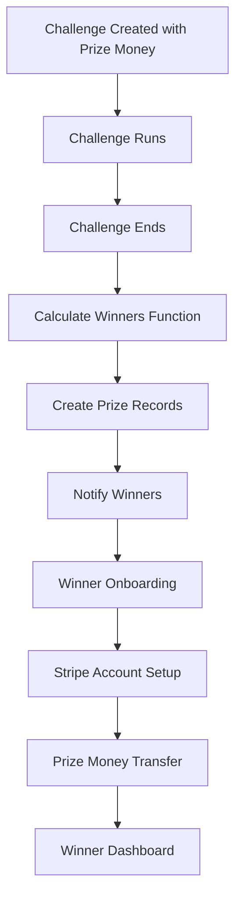

# Pulse Stripe Prize Money System - Complete Documentation

## Table of Contents
1. [System Overview](#system-overview)
2. [Existing Stripe Infrastructure](#existing-stripe-infrastructure)
3. [Prize Money System Architecture](#prize-money-system-architecture)
4. [Data Models](#data-models)
5. [Netlify Functions](#netlify-functions)
6. [Frontend Components](#frontend-components)
7. [End-to-End Flows](#end-to-end-flows)
8. [Testing Guide](#testing-guide)
9. [Security & Compliance](#security--compliance)
10. [Troubleshooting](#troubleshooting)

---

## System Overview

The Pulse Prize Money System extends the existing Stripe Connect infrastructure to support automated prize money distribution for challenge winners. The system maintains the same 3% platform fee structure and security standards while adding comprehensive winner management.

### Key Features
- **Automated winner calculation** based on pulse points
- **Flexible prize distribution** (winner takes all, top 3, custom splits)
- **Secure Stripe Connect onboarding** for winners
- **Automated prize transfers** with full audit trails
- **Comprehensive error handling** and retry mechanisms
- **Winner dashboard** for earnings tracking

---

## Existing Stripe Infrastructure

### Current Trainer System
The platform already has a robust Stripe Connect system for trainers:

#### Core Functions
- **`create-connected-account.js`** - Creates Stripe Express accounts
- **`complete-stripe-onboarding.js`** - Manages onboarding completion
- **`get-earnings.js`** - Retrieves earnings and balance data
- **`get-dashboard-link.js`** - Generates Stripe dashboard access
- **`reset-onboarding.js`** - Resets onboarding for testing

#### Data Structure
```javascript
// User document - creator field
{
  creator: {
    stripeAccountId: "acct_xxx",
    onboardingStatus: "complete", // notStarted, incomplete, complete
    onboardingLink: "https://connect.stripe.com/...",
    onboardingExpirationDate: 1234567890,
    onboardingPayoutState: "introduction"
  }
}
```

#### Collections
- **`users`** - Main user documents with creator field
- **`stripeConnect`** - Backup Stripe account tracking
- **`payments`** - Payment records for dashboard display

#### Platform Economics
- **3% platform fee** on all trainer earnings
- **Automatic transfers** to connected accounts
- **Real-time balance tracking** via Stripe API

---

## Prize Money System Architecture

### High-Level Flow


### System Components

#### 1. Challenge Configuration
- Prize money enabled via `prizeMoney` field
- Multiple distribution types supported
- Configurable winner counts and amounts

#### 2. Winner Management
- New `winner` field in user documents
- Separate Stripe accounts from trainer accounts
- Complete earnings history tracking

#### 3. Prize Processing
- Automated winner calculation
- Secure transfer processing
- Comprehensive status tracking

---

## Data Models

### Challenge Model Enhancement

#### iOS Swift
```swift
struct PrizeMoney: Codable, Equatable {
    var isEnabled: Bool = false
    var totalAmount: Int = 0  // Amount in cents
    var currency: String = "USD"
    var winnerCount: Int = 1
    var distributionType: PrizeDistributionType = .winner_takes_all
    var customDistribution: [Int] = []  // Custom percentages
    
    func calculatePrizeDistribution() -> [Int] {
        // Prize calculation logic
    }
}

enum PrizeDistributionType: String, CaseIterable {
    case winner_takes_all = "winner_takes_all"
    case top_three_equal = "top_three_equal"
    case top_three_weighted = "top_three_weighted" // 50/30/20%
    case custom = "custom"
}
```

#### Web TypeScript
```typescript
export class PrizeMoney {
  isEnabled: boolean;
  totalAmount: number; // Amount in cents
  currency: string;
  winnerCount: number;
  distributionType: PrizeDistributionType;
  customDistribution: number[]; // Percentages for custom distribution

  calculatePrizeDistribution(): number[] {
    // Returns array of prize amounts in cents
  }
}

export enum PrizeDistributionType {
  WINNER_TAKES_ALL = "winner_takes_all",
  TOP_THREE_EQUAL = "top_three_equal", 
  TOP_THREE_WEIGHTED = "top_three_weighted",
  CUSTOM = "custom"
}
```

### Winner Model

#### User Document Enhancement
```javascript
{
  // Existing user fields...
  winner: {
    id: "user_id",
    stripeAccountId: "acct_winner_xxx",
    onboardingStatus: "complete",
    onboardingLink: "https://connect.stripe.com/...",
    onboardingExpirationDate: 1234567890,
    challengeWins: [{
      challengeId: "challenge_123",
      challengeTitle: "Morning Mobility Challenge",
      placement: 1,
      prizeAmount: 10000, // $100.00 in cents
      status: "paid", // pending, processing, paid, failed
      awardedAt: "2024-01-15T10:00:00Z",
      paidAt: "2024-01-15T14:30:00Z",
      stripeTransferId: "tr_xxx",
      winnerAmount: 9700, // After 3% platform fee
      platformFee: 300
    }],
    totalEarnings: 9700, // Total amount earned (after fees)
    createdAt: "2024-01-15T10:00:00Z",
    updatedAt: "2024-01-15T14:30:00Z"
  }
}
```

### Prize Records Collection
```javascript
// Collection: prizeRecords
{
  id: "challenge_123_user_456_1705320000",
  challengeId: "challenge_123",
  challengeTitle: "Morning Mobility Challenge",
  userId: "user_456",
  username: "johndoe",
  placement: 1,
  score: 2850, // Pulse points total
  prizeAmount: 10000, // Original prize amount
  winnerAmount: 9700, // Amount after platform fee
  platformFee: 300, // 3% platform fee
  status: "paid", // pending, processing, paid, failed
  stripeTransferId: "tr_xxx",
  failureReason: null, // If status is 'failed'
  createdAt: "2024-01-15T10:00:00Z",
  processingStartedAt: "2024-01-15T14:25:00Z",
  paidAt: "2024-01-15T14:30:00Z",
  updatedAt: "2024-01-15T14:30:00Z"
}
```

---

## Netlify Functions

### Core Prize Money Functions

#### 1. `calculate-winners.js`
**Purpose**: Calculate challenge winners and create prize records

**Endpoint**: `POST /.netlify/functions/calculate-winners`

**Input**:
```javascript
{
  "challengeId": "challenge_123"
}
```

**Process**:
1. Fetch challenge document and validate prize money configuration
2. Get all participants from `user-challenge` collection
3. Sort participants by `pulsePoints.totalPoints` (descending)
4. Calculate prize distribution based on challenge configuration
5. Create prize records in `prizeRecords` collection
6. Update user documents with winner information
7. Update challenge with winner summary

**Output**:
```javascript
{
  "success": true,
  "winners": [{
    "userId": "user_456",
    "username": "johndoe", 
    "placement": 1,
    "score": 2850,
    "prizeAmount": 10000
  }],
  "totalPrizeAmount": 10000,
  "prizeRecords": [...]
}
```

#### 2. `payout-prize-money.js`
**Purpose**: Process actual prize money transfers to winners

**Endpoint**: `POST /.netlify/functions/payout-prize-money`

**Input**:
```javascript
{
  "prizeRecordId": "challenge_123_user_456_1705320000"
}
```

**Process**:
1. Fetch prize record and validate status
2. Get winner's Stripe account ID from user document
3. Calculate platform fee (3%) and winner amount
4. Create Stripe transfer to winner's connected account
5. Update prize record with transfer details
6. Update user's winner field with payment information

**Output**:
```javascript
{
  "success": true,
  "transferId": "tr_xxx",
  "winnerAmount": 9700,
  "platformFee": 300,
  "recipient": "johndoe",
  "challengeTitle": "Morning Mobility Challenge"
}
```

#### 3. `create-winner-connected-account.js`
**Purpose**: Create Stripe Connect accounts for winners

**Endpoint**: `POST /.netlify/functions/create-winner-connected-account`

**Input**:
```javascript
{
  "userId": "user_456",
  "challengeId": "challenge_123",
  "placement": "1"
}
```

**Process**:
1. Check if user already has a Stripe account
2. Create new Stripe Express account if needed
3. Generate onboarding link with proper redirect URLs
4. Update user document with account information
5. Create backup record in `winnerStripeConnect` collection

**Output**:
```javascript
{
  "success": true,
  "accountLink": "https://connect.stripe.com/setup/..."
}
```

#### 4. `get-winner-prize-info.js`
**Purpose**: Get challenge and prize information for winners

**Endpoint**: `GET /.netlify/functions/get-winner-prize-info?challengeId=X&placement=Y`

**Output**:
```javascript
{
  "success": true,
  "challengeInfo": {
    "title": "Morning Mobility Challenge",
    "prizeAmount": 10000,
    "placement": 1,
    "totalPrizePool": 10000,
    "distributionType": "winner_takes_all"
  }
}
```

#### 5. `complete-winner-stripe-onboarding.js`
**Purpose**: Mark winner Stripe onboarding as complete

**Endpoint**: `GET /.netlify/functions/complete-winner-stripe-onboarding?userId=X`

**Process**:
1. Update user's `winner.onboardingStatus` to 'complete'
2. Return success confirmation

### Supporting Functions

#### Prize Distribution Calculation
Used across multiple functions:

```javascript
function calculatePrizeDistribution(prizeMoney) {
  const { totalAmount, distributionType, winnerCount, customDistribution } = prizeMoney;
  
  switch (distributionType) {
    case 'winner_takes_all':
      return [totalAmount];
    
    case 'top_three_equal':
      const amountPerWinner = Math.floor(totalAmount / 3);
      return [amountPerWinner, amountPerWinner, amountPerWinner];
    
    case 'top_three_weighted':
      const first = Math.floor(totalAmount * 0.5);  // 50%
      const second = Math.floor(totalAmount * 0.3); // 30%
      const third = totalAmount - first - second;   // 20%
      return [first, second, third];
    
    case 'custom':
      if (customDistribution && customDistribution.length === winnerCount &&
          customDistribution.reduce((sum, pct) => sum + pct, 0) === 100) {
        return customDistribution.map(pct => 
          Math.floor(totalAmount * pct / 100.0)
        );
      } else {
        // Fallback to equal distribution
        const equalAmount = Math.floor(totalAmount / winnerCount);
        return Array(winnerCount).fill(equalAmount);
      }
    
    default:
      return [totalAmount];
  }
}
```

---

## Frontend Components

### Winner Onboarding Page

#### `/winner/connect-account.tsx`
**Purpose**: Guide winners through Stripe Connect onboarding

**Features**:
- Congratulatory messaging with challenge details
- Prize amount display with placement information
- Secure Stripe onboarding integration
- Real-time account status checking
- Error handling and retry mechanisms

**URL Parameters**:
- `challengeId`: Challenge the user won
- `placement`: Winner's placement (1st, 2nd, 3rd, etc.)

**Key Functions**:
```typescript
const fetchChallengeInfo = async () => {
  // Get challenge and prize information
};

const checkConnectAccountStatus = async () => {
  // Check if user already has Stripe account
  // Handle existing onboarding links
};

const handleStartOnboarding = async () => {
  // Create new Stripe Connect account
  // Redirect to Stripe onboarding
};
```

#### UI Components
```jsx
// Prize display
<div className="bg-gradient-to-r from-yellow-400/20 to-orange-400/20">
  <h2>Challenge Winner</h2>
  <p><strong>{challengeInfo.title}</strong></p>
  <p className="text-2xl font-bold text-[#E0FE10]">
    Prize: ${(challengeInfo.prizeAmount / 100).toFixed(2)}
  </p>
  <p>{challengeInfo.placement === 1 ? '🥇 1st Place' : 
      challengeInfo.placement === 2 ? '🥈 2nd Place' : 
      challengeInfo.placement === 3 ? '🥉 3rd Place' : 
      `#${challengeInfo.placement} Place`}
  </p>
</div>

// Onboarding button
<button 
  onClick={handleStartOnboarding}
  className="bg-[#E0FE10] text-black py-3 px-6 rounded-xl font-semibold"
>
  {loading ? 'Setting Up...' : 'Set Up Payment Account'}
</button>
```

### Winner Dashboard (Future Enhancement)

#### `/winner/dashboard.tsx` (To be implemented)
**Purpose**: Allow winners to track their earnings and payments

**Features**:
- Total earnings display
- Individual prize history
- Payment status tracking
- Stripe dashboard access
- Tax document downloads

---

## End-to-End Flows

### Flow 1: Challenge Creation with Prize Money

#### For Challenge Creators:
1. **Create Challenge** via programming interface or admin panel
2. **Configure Prize Money**:
   ```javascript
   {
     prizeMoney: {
       isEnabled: true,
       totalAmount: 10000, // $100.00
       currency: "USD",
       distributionType: "winner_takes_all",
       winnerCount: 1
     }
   }
   ```
3. **Publish Challenge** - participants can join normally
4. **Challenge Runs** - uses existing workout tracking logic

#### Data Flow:
```
Admin Panel → Challenge Creation → Firestore Challenge Document
   ↓
Prize Money Configuration Saved
   ↓
Challenge Published (Normal Flow)
```

### Flow 2: Winner Calculation and Notification

#### Automatic Process (Challenge End):
1. **Challenge Status Change** triggers notification function
2. **Calculate Winners** function called automatically
3. **Prize Records Created** in Firestore
4. **Winner Notifications Sent** via existing FCM system

#### Manual Process (Admin):
1. **Admin calls** `/.netlify/functions/calculate-winners`
2. **Winners calculated** based on pulse points
3. **Prize distribution** calculated per challenge configuration
4. **Database updates** performed atomically

#### Data Flow:
```
Challenge Ends → Winner Calculation → Prize Record Creation
   ↓
User Document Updates → Notification System → Winner Notified
```

### Flow 3: Winner Onboarding and Account Setup

#### Winner Experience:
1. **Receive Notification** "Congratulations! You won [Challenge Name]"
2. **Click Link** or navigate to winner connect page
3. **View Prize Information**:
   - Challenge details
   - Prize amount
   - Placement information
4. **Start Onboarding** - redirects to Stripe Connect
5. **Complete Stripe Forms**:
   - Personal information
   - Banking details
   - Identity verification
6. **Account Approved** - automatic redirect to dashboard

#### Technical Flow:
```
Winner URL → Challenge Info Fetch → Stripe Account Creation
   ↓
Stripe Onboarding → Account Verification → Status Update
   ↓
Onboarding Complete → Ready for Payment
```

### Flow 4: Prize Money Transfer

#### Automatic Transfer (When Account Ready):
1. **Account Status Check** - verify Stripe account is active
2. **Prize Transfer Initiated** via `payout-prize-money` function
3. **Platform Fee Calculated** (3% of prize amount)
4. **Stripe Transfer Created** to winner's connected account
5. **Status Updates** across all relevant records
6. **Winner Notification** of successful payment

#### Manual Transfer (Admin Control):
1. **Admin reviews** prize records in dashboard
2. **Initiates payout** for specific prize record
3. **System processes** transfer with full audit trail
4. **Confirmation provided** to admin and winner

#### Data Flow:
```
Prize Record → Account Validation → Transfer Calculation
   ↓
Stripe Transfer API → Transfer Confirmation → Status Updates
   ↓
Winner Notification → Payment Complete
```

### Flow 5: Error Handling and Recovery

#### Common Error Scenarios:

**1. Winner Missing Stripe Account:**
- Prize record marked as 'failed'
- Winner directed to onboarding flow
- Automatic retry after account setup

**2. Stripe Transfer Failure:**
- Transfer error logged with details
- Prize record status updated
- Admin notification for manual review
- Automatic retry mechanism (future enhancement)

**3. Onboarding Incomplete:**
- Link expiration handling
- New link generation
- Status tracking and notifications

---

## Testing Guide

### Environment Setup

#### Required Environment Variables:
```bash
# Stripe Configuration
STRIPE_SECRET_KEY=sk_test_xxx
STRIPE_PUBLISHABLE_KEY=pk_test_xxx

# Firebase Configuration  
FIREBASE_SECRET_KEY=xxx
FIREBASE_PRIVATE_KEY=xxx

# Site Configuration
SITE_URL=https://fitwithpulse.ai
```

#### Test Data Setup:
1. **Create Test Challenge** with prize money enabled
2. **Add Test Participants** with different pulse point scores
3. **Configure Test Stripe Accounts** for winners

### Testing Phases

#### Phase 1: Challenge Configuration Testing
```bash
# Test challenge creation with prize money
curl -X POST /api/challenges \
  -H "Content-Type: application/json" \
  -d '{
    "title": "Test Prize Challenge",
    "prizeMoney": {
      "isEnabled": true,
      "totalAmount": 5000,
      "distributionType": "winner_takes_all"
    }
  }'
```

**Verify**:
- [ ] Challenge saves with prize configuration
- [ ] Prize money displays in challenge details
- [ ] Participants can join normally

#### Phase 2: Winner Calculation Testing
```bash
# Test winner calculation
curl -X POST /.netlify/functions/calculate-winners \
  -H "Content-Type: application/json" \
  -d '{"challengeId": "test_challenge_123"}'
```

**Verify**:
- [ ] Winners calculated correctly by pulse points
- [ ] Prize distribution matches configuration
- [ ] Prize records created in Firestore
- [ ] User documents updated with winner info
- [ ] Challenge document updated with results

#### Phase 3: Winner Onboarding Testing
1. **Access Winner Page**: `/winner/connect-account?challengeId=test_123&placement=1`
2. **Verify Challenge Info**: Prize amount and details display
3. **Start Onboarding**: Click "Set Up Payment Account"
4. **Complete Stripe Flow**: Use test banking information
5. **Verify Account Creation**: Check Stripe dashboard

**Test Banking Details** (Stripe Test Mode):
- **Routing Number**: 110000000
- **Account Number**: 000123456789
- **SSN**: 000-00-0000

**Verify**:
- [ ] Challenge information displays correctly
- [ ] Stripe onboarding link generated
- [ ] Account creation successful
- [ ] User document updated with Stripe account ID
- [ ] Onboarding status marked complete

#### Phase 4: Prize Payout Testing
```bash
# Test prize payout
curl -X POST /.netlify/functions/payout-prize-money \
  -H "Content-Type: application/json" \
  -d '{"prizeRecordId": "test_challenge_123_user_456_1705320000"}'
```

**Verify**:
- [ ] Stripe transfer created successfully
- [ ] Platform fee calculated correctly (3%)
- [ ] Prize record status updated to 'paid'
- [ ] User winner field updated with payment details
- [ ] Transfer appears in Stripe dashboard

#### Phase 5: Error Scenario Testing

**Test Cases**:
1. **Missing Stripe Account**: Attempt payout before onboarding
2. **Invalid Prize Record**: Use non-existent prize record ID
3. **Duplicate Payout**: Attempt to pay already-paid prize
4. **Stripe API Failure**: Simulate Stripe downtime

**Verify**:
- [ ] Appropriate error messages returned
- [ ] Database state remains consistent
- [ ] Failed operations logged properly
- [ ] Recovery mechanisms work correctly

### Load Testing

#### Concurrent Winner Processing:
```bash
# Test multiple winners simultaneously
for i in {1..10}; do
  curl -X POST /.netlify/functions/calculate-winners \
    -H "Content-Type: application/json" \
    -d "{\"challengeId\": \"test_challenge_$i\"}" &
done
wait
```

#### Stress Test Scenarios:
- **100+ participants** in single challenge
- **Multiple challenges** ending simultaneously  
- **Rapid onboarding** requests
- **Concurrent payout** processing

---

## Security & Compliance

### Data Protection

#### Sensitive Data Handling:
- **No raw financial data** stored in application database
- **Stripe handles** all payment processing and PCI compliance
- **User data encrypted** in transit and at rest
- **Access logs** maintained for all financial operations

#### API Security:
- **Environment variables** for all secrets
- **Request validation** on all endpoints
- **Rate limiting** on sensitive operations
- **Audit trails** for all financial transactions

### Stripe Security Features

#### Connect Account Security:
- **Express accounts** limit platform liability
- **Identity verification** required for all winners
- **Bank account validation** through Stripe
- **Fraud detection** built into Stripe platform

#### Transfer Security:
- **Two-party transfers** (platform → winner)
- **Immediate settlement** to reduce exposure
- **Transfer reversal** capabilities for disputes
- **Compliance monitoring** via Stripe dashboard

### Compliance Considerations

#### Financial Regulations:
- **1099-NEC forms** may be required for winners over $600/year
- **State tax implications** vary by winner location
- **Platform liability** limited through Stripe Connect structure
- **Terms of service** updates required for prize money

#### Data Retention:
- **Prize records** retained for 7 years (tax compliance)
- **Transfer logs** maintained in Stripe systems
- **User financial data** only stored as necessary
- **Deletion policies** must account for financial records

---

## Troubleshooting

### Common Issues

#### 1. Winner Calculation Problems

**Symptoms**:
- Incorrect winners selected
- Prize amounts don't match configuration
- Missing participants in calculation

**Debugging**:
```bash
# Check participant data
curl /.netlify/functions/debug-participants?challengeId=XXX

# Verify pulse points calculation
curl /.netlify/functions/debug-scores?challengeId=XXX
```

**Solutions**:
- Verify `pulsePoints.totalPoints` field exists
- Check challenge date filters
- Validate participant data integrity

#### 2. Onboarding Flow Issues

**Symptoms**:
- Onboarding link expired
- Stripe account creation fails
- User stuck in incomplete status

**Debugging**:
```javascript
// Check user winner field
db.collection('users').doc(userId).get()
  .then(doc => console.log(doc.data().winner))

// Verify Stripe account status
stripe.accounts.retrieve(stripeAccountId)
  .then(account => console.log(account.details_submitted))
```

**Solutions**:
- Generate new onboarding link
- Check Stripe account requirements
- Reset onboarding status if needed

#### 3. Payout Transfer Failures

**Symptoms**:
- Transfer fails with Stripe error
- Prize record stuck in 'processing'
- Winner reports no payment received

**Debugging**:
```bash
# Check Stripe transfer status
curl -X GET "https://api.stripe.com/v1/transfers/tr_XXX" \
  -H "Authorization: Bearer sk_test_XXX"

# Check account balance
curl -X GET "https://api.stripe.com/v1/balance" \
  -H "Authorization: Bearer sk_test_XXX"
```

**Solutions**:
- Verify sufficient platform balance
- Check connected account status
- Retry transfer if temporary failure
- Contact Stripe support for persistent issues

### Monitoring and Alerts

#### Key Metrics to Monitor:
- **Payout success rate** (target: >99%)
- **Onboarding completion rate** (target: >80%)
- **Average payout time** (target: <24 hours)
- **Error rates** by function (target: <1%)

#### Alerting Setup:
```javascript
// Example monitoring function
const monitorPayouts = async () => {
  const failedPayouts = await db.collection('prizeRecords')
    .where('status', '==', 'failed')
    .where('updatedAt', '>', Date.now() - 86400000) // 24 hours
    .get();
    
  if (failedPayouts.size > 0) {
    // Send alert to admin
    await sendSlackAlert(`${failedPayouts.size} failed payouts in last 24h`);
  }
};
```

### Support Procedures

#### Winner Support Checklist:
1. **Verify winner eligibility** in challenge results
2. **Check onboarding status** in user document
3. **Validate Stripe account** setup and verification
4. **Review prize record** status and any error messages
5. **Test payout process** in development environment
6. **Escalate to Stripe** if platform-level issue

#### Admin Tools Needed:
- **Firebase console** access for data verification
- **Stripe dashboard** access for payment troubleshooting  
- **Netlify functions** logs for debugging
- **User support** ticket system integration

---

## Future Enhancements

### Planned Features

#### 1. Winner Dashboard
- **Earnings overview** with tax documents
- **Payment history** with detailed breakdowns
- **Stripe dashboard** integration
- **Bank account management**

#### 2. Advanced Prize Structures
- **Team-based prizes** for group challenges
- **Milestone rewards** for partial completion
- **Bonus multipliers** for streaks
- **Charity donation** options

#### 3. Admin Management Tools
- **Prize pool management** dashboard
- **Payout scheduling** and batching
- **Winner verification** workflows
- **Financial reporting** and analytics

#### 4. Automated Tax Compliance
- **1099 form generation** for annual winners
- **Tax document** delivery system
- **State tax** reporting integration
- **International winner** support

### Technical Improvements

#### 1. Performance Optimization
- **Batch processing** for multiple winners
- **Caching strategies** for prize calculations
- **Database indexing** for faster queries
- **CDN integration** for static assets

#### 2. Enhanced Error Handling
- **Automatic retry** mechanisms
- **Circuit breaker** patterns for external APIs
- **Graceful degradation** during outages
- **Comprehensive logging** and monitoring

#### 3. Security Enhancements
- **Multi-factor authentication** for admin functions
- **IP whitelisting** for sensitive operations
- **Webhook signature** verification
- **Rate limiting** improvements

---

This documentation serves as the complete guide for understanding, implementing, testing, and maintaining the Pulse Prize Money System. For questions or support, contact the development team or refer to the Stripe Connect documentation for platform-specific issues. 